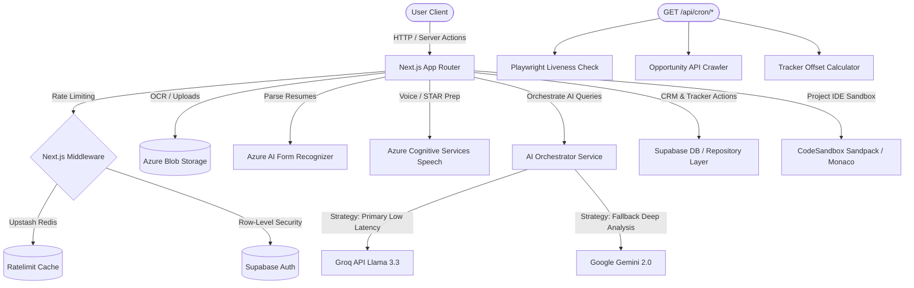

<div align="center">

# 🚀 MOCKMATE

### Master Your Career Path with AI-Powered Intelligence

MockMate is a state-of-the-art, AI-driven career laboratory and developer optimization platform. It bridges the gap between engineering potential and industry expectations through immersive simulation, real-time technical combat, automated resume tailoring, and deep deterministic profile evaluations.

<br/>

[](https://mockmate-delta.vercel.app/)

[](https://nextjs.org/)
[](https://www.typescriptlang.org/)
[](https://supabase.com/)
[](https://tailwindcss.com/)
[](https://upstash.com/)
[](https://playwright.dev/)

</div>

<br/>

---

## 🏛️ System Architecture

MockMate operates on a robust multi-tier stack, orchestrating local caching, Azure Cognitive Services, database synchronization, and fallback AI providers:



<br/>

---

## 🚀 Flagship Systems

### 1. 🔍 ATS Scoring & Parsing Engine
The ATS Engine simulates high-tier enterprise parsing logic (e.g., Greenhouse, Workday) to evaluate resumes against target roles.
*   **Mathematical Scoring Rubric**: Scores are derived deterministically using a weighted index:
    $$\text{ATS Score} = \text{round}\left( (\text{Format} \times 0.25) + (\text{Content Metrics} \times 0.35) + (\text{Keyword Density} \times 0.40) \right)$$
*   **Structural Section Check**: Ensures the presence of mandatory resume blocks: Summary, Experience, Education, Skills, Projects, and Contact.
*   **Keyword Match**: Compares the resume content with target job descriptions using a text-normalization pipeline.
*   **Tactical Feedback**: Generates granular recommendations, providing concrete "before" and "after" examples to help rewrite vague bullets into metric-driven achievements.

### 2. 🧬 Deep Evaluation (Deep Eval) Engine
For candidate validation, the Deep Eval service goes beyond static resume text, incorporating public developer history:
*   **GitHub Username Extractor & Heuristics**: Automatically searches the uploaded resume text using RegExp patterns matching `github.com/[username]` or `github: @[username]`, ignoring system-level false positives (e.g., `settings`, `explore`, `pricing`).
*   **Parallel Fetching & Integration**: Pulls the public profile (name, bio, followers, created date) and top 30 owner repositories in parallel with an 8-second maximum execution timeout, utilizing a `GITHUB_TOKEN` fallback for higher rate limits.
*   **Open Source vs. Self Projects**: Implements strict classification rules. General repository owners are graded as *Self Projects* unless there is evidence of community engagement (stars/forks/contributors). True open-source contributions involve external repository edits.
*   **Dynamic Bonuses & Deductions**:
    *   **Bonuses**: Earn +5 for GSoC, +3 for GSSoC, +3 to +5 for founder/co-founder roles, +2 for portfolio sites, and +1 for LinkedIn links.
    *   **Deductions**: Deducts points for simple classroom tutorials (todo-lists, calculators), missing links, broken URLs, or unverified claims.
*   **Missing Keywords**: Isolates up to 10 critical technical skills missing from the candidate's resume relative to the job requirements.

### 3. 💼 Career Ops CRM Tracker & Pipelines
A fully-fledged Customer Relationship Management (CRM) board to track, optimize, and organize the application pipeline:
*   **Canonical Application Statuses**: Tracks roles via discrete steps: `evaluated`, `applied`, `responded`, `interview`, `offer`, `rejected`, `discarded`, and `skip`.
*   **Salary Benchmarking Engine & Experience Scaling**: Integrates local dataset lookups (`data/salaries.india.json`) that adjust salary bands automatically based on the candidate's experience years:
    *   *Fresher/Intern (0-1 yrs)*: Bottom of range.
    *   *Junior (2-3 yrs)*: Lower-mid range.
    *   *Mid-level (4-6 yrs)*: Direct median dataset value.
    *   *Senior (7-10 yrs)*: Upper range.
    *   *Staff/Principal (11+ yrs)*: Top of range + 25% premium.
    *   *AI Fallback*: If the target role is missing from the database, the AI orchestrator dynamically generates a calibrated market estimate.
*   **Dynamic Cadence Offset**: Automatically calculates the next date a user should follow up based on application status and cumulative touchpoints:
    *   *Base Intervals*: `evaluated` (3 days), `applied` (5 days), `responded` (4 days), `interview` (2 days).
    *   *Follow-up Offsets*: 0 followups (+0 days), 1 followup (+1 day), 2 followups (+2 days), $\ge 3$ followups (+4 days).
*   **AI Dimensions**: Classifies applications under **Role Archetypes** (e.g., `backend`, `data_ml`, `devops`, `frontend`) and identifies **Primary Blockers** (e.g., `stack-mismatch`, `seniority-mismatch`, `domain-mismatch`).
*   **Diagnostic CLI Tools**:
    ```bash
    # Run sanity checks on database constraints and status mapping
    npm run verify:career-ops
    
    # Run developer repairs on inconsistent tracker entries
    npm run doctor:career-ops
    ```

<br/>

---

## 🤖 Background Automation Pipelines (Cron Services)

MockMate features automated cron handlers to maintain data liveness and pipeline freshness:

### 1. Opportunity API Crawler (`GET /api/cron/scan`)
*   Periodically scans configured companies (e.g., Cohere, Anthropic via Lever/Greenhouse APIs) in concurrency-throttled chunks.
*   Applies a double-keyword filter: positive keywords (e.g., `engineer`, `developer`, `machine learning`) to match roles, and negative keywords (e.g., `intern`, `junior`) to filter out irrelevant posts.
*   Deduplicates results against existing database entries using URL and cryptographic job fingerprint matches.

### 2. Playwright Liveness Checker (`GET /api/cron/liveness`)
*   Launches headless Chromium instances in the background using Playwright to navigate to saved job posting URLs.
*   Validates whether opportunities are still open by crawling the DOM, checking text components, and analyzing interactive elements (e.g., presence of "Apply Now", "Apply for this Job" buttons).
*   Updates statuses in the database to `active`, `uncertain`, or `expired` to prevent users from applying to dead listings.

### 3. Cadence Recalculator (`GET /api/cron/cadence`)
*   Identifies active users who have tracked applications.
*   Recalculates follow-up cadence targets based on status changes and new follow-up logs, ensuring the dashboard notifications and active reminders stay correct.

<br/>

---

## 🛠️ Extended Features

*   **Resume Tailoring**: Adapts summaries, lists relevant technologies, and re-orders work highlights to match target job descriptions without fabricating credentials.
*   **AI Cover Letters & Cold Outreach**: Automatically creates professional cover letters and short LinkedIn cold outreach notes customized to recruiter preferences.
*   **Project Mode (DevCube Sandbox)**: Multi-file browser IDE powered by `@codesandbox/sandpack-react` and `@monaco-editor/react`. Allows junior developers to solve challenges, modify starter codes, and receive code-quality ratings.
*   **System Design Canvas**: A visual diagramming editor supporting drag-and-drop components (API Gateways, Load Balancers, Databases, Caches) to map distributed system layouts.
*   **Certification Hub**: Practice environments for AWS, Azure, MongoDB, Salesforce, and PCAP Python exams, offering step-by-step rationale.
*   **Daily Coding Arena**: Multi-language workspace executing code in Python, JavaScript, Go, and C++ against custom test suites.

<br/>

---

## 🎮 Gamification & Badges

MockMate implements an interactive gamification pipeline. Users earn XP for daily logins, quiz completions, and technical triumphs in the Arena. Streaks trigger progressive XP multipliers (1.2x for 3+ days, 1.5x for 7+ days, 2.0x for 30+ days).

<details>
<summary><b>🏆 View Unlocked Badges (17 Total)</b></summary>
<br/>

| Badge ID | Badge Name | Criteria | Color Theme |
|:---|:---|:---|:---|
| `early-adopter` | Early Adopter | Joined the platform during alpha | Yellow |
| `first-quiz` | First Steps | Completed 1st certification quiz | Green |
| `quiz-master` | Quiz Master | Completed 5+ quizzes | Blue |
| `quiz-veteran` | Quiz Veteran | Completed 25+ quizzes | Purple |
| `quiz-legend` | Quiz Legend | Completed 100+ quizzes | Amber |
| `perfectionist`| Perfectionist | Average score $\ge 90\%$ | Red |
| `sharpshooter` | Sharpshooter | Average score $\ge 95\%$ | Rose |
| `streak-3` | Streak Keeper | Maintained a 3-day active streak | Orange |
| `streak-7` | Week Warrior | Maintained a 7-day active streak | Orange |
| `streak-30` | Monthly Machine| Maintained a 30-day active streak | Red |
| `arena-warrior`| Arena Warrior | Won 5+ Arena battles | Red |
| `arena-champion`| Arena Champion| Won 25+ Arena battles | Red |
| `xp-500` | Rising Star | Earned 500+ lifetime XP | Yellow |
| `xp-5000` | Powerhouse | Earned 5,000+ lifetime XP | Yellow |
| `momentum` | Momentum | Unlocked 1.2x streak multiplier | Emerald |
| `on-fire` | On Fire | Unlocked 1.5x streak multiplier | Emerald |
| `unstoppable` | Unstoppable | Unlocked 2.0x streak multiplier | Emerald |
| `ranked` | Ranked | Reached Arena Elo rating $\ge 1200$ | Indigo |
| `elite` | Elite | Reached Arena Elo rating $\ge 1500$ | Indigo |

</details>

<br/>

---

## 📦 Directory Structure

```text
mockmate/
├── app/                  # Next.js App Router
│   ├── (main)/           # Primary dashboard, certification & tracker routes
│   ├── (immersive)/      # Full-screen sandboxed IDE & Canvas modules
│   ├── actions/          # Type-safe Server Actions (Auth, CRM, AI, Sandpack)
│   └── api/              # API endpoints & Playwright Cron schedulers
├── components/           # Atomic components UI Library (Framer Motion, Lucide)
├── docs/                 # Data contracts & API manuals
├── hooks/                # Custom React query & viewport hooks
├── lib/                  # Services layer (ATS score, OCR, DB repo strategy)
├── scripts/              # Developer CLI diagnostic tools
├── styles/               # Tailwind themes and global sheets
├── types/                # Typescript structures
└── utils/                # Supabase configs, sanitization & string utilities
```

<br/>

---

## ⚡ Getting Started

### 1. Prerequisites
Ensure you have the following installed:
*   **Node.js**: $\ge$ v20.11.0
*   **Supabase Project**: Database engine + Email Auth enabled.
*   **Upstash Account**: Serverless Redis endpoint.
*   **API Tokens**: Google AI Studio (Gemini), Groq, and Azure Cognitive Services credentials.

### 2. Setup Environment Variables
Configure `.env.local` based on `.env.example`:

| Key | Description |
|:---|:---|
| `NEXT_PUBLIC_SUPABASE_URL` | Supabase endpoint URL |
| `NEXT_PUBLIC_SUPABASE_ANON_KEY` | Supabase client access key |
| `SUPABASE_SERVICE_ROLE_KEY` | Admin bypass token (Cron/DB sync) |
| `GEMINI_API_KEY` | Google AI Studio developer API token |
| `GROQ_API_KEY` | Groq developer API token |
| `UPSTASH_REDIS_REST_URL` | Upstash Redis connection URL |
| `UPSTASH_REDIS_REST_TOKEN` | Upstash API token |
| `AZURE_SPEECH_KEY` | Azure Cognitive Speech API token |
| `AZURE_SPEECH_REGION` | Azure Speech deploy region (e.g. `eastus`) |
| `AZURE_FORM_RECOGNIZER_ENDPOINT`| Azure AI Document Intelligence URL |
| `AZURE_FORM_RECOGNIZER_KEY` | Azure AI Document Intelligence access key |

### 3. Apply Schema Migrations
MockMate uses PostgreSQL triggers and Row-Level Security. Apply the migration SQL files located in `lib/db/migrations/` to your Supabase SQL Editor in the following order:

```text
1. add_user_stats.sql                      # Set up user profile metrics, XP & Streaks
2. add_career_ops_tracking.sql             # Create CRM tracking tables & limits
3. add_career_ops_pattern_dimensions.sql   # Inject role archetypes and blockers
4. add_system_designs.sql                  # Setup system design canvas layout stores
5. add_project_results.sql                 # Create project-mode DevCube history tables
6. 20260419_add_ats_score_to_apps.sql      # Link ATS scoring cache to tracking rows
7. 20260620_normalize_arena_results.sql    # Setup matchmaking tables and Elo scores
```

### 4. Running Locally
```bash
# Install dependencies
npm install

# Run the next dev server
npm run dev
```

---

<div align="center">

**MIT License — © 2026 MockMate**

</div>
